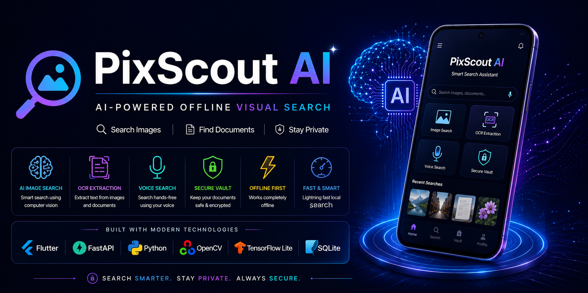

<div align="center">
  
</p>

# 🚀 PixScout AI

### AI-Powered Offline Visual Search & Secure Document Assistant


</div>

---

# 📖 About Project

PixScout AI is an intelligent Android application that allows users to search images and documents instantly using Artificial Intelligence, Computer Vision, OCR and Voice Search.

Unlike traditional gallery applications, PixScout AI understands image content and retrieves files intelligently while keeping all personal data secure through offline processing.

---

# ✨ Features

✅ AI Image Search

✅ OCR Text Extraction

✅ Voice Search

✅ Offline Processing

✅ Secure Document Vault

✅ Fast Local Search

✅ Computer Vision

✅ Biometric Authentication

---

# 🛠 Tech Stack

| Technology | Purpose |
|------------|---------|
| Flutter | Android App |
| FastAPI | Backend |
| Python | AI |
| OpenCV | Image Processing |
| TensorFlow Lite | AI Model |
| Tesseract OCR | OCR |
| SQLite | Offline Storage |

---

# 📂 Project Structure

```text
PixScout-AI
│
├── frontend
├── backend
├── ai
├── assets
├── docs
└── database
```

---

# 🎯 Objectives

• Intelligent Offline Search

• AI Powered Recognition

• OCR Support

• Voice Search

• Privacy Protection

• Secure Storage

---

# 🚀 Future Scope

- Cloud Sync
- Face Recognition
- AI Chat Assistant
- Smart Gallery
- Multilingual Search

---

# 👩‍💻 Developer

## Anubha Saini

B.Tech AI & ML

Career Point University

India 🇮🇳

---

# ⭐ If you like this project don't forget to Star the Repository.
